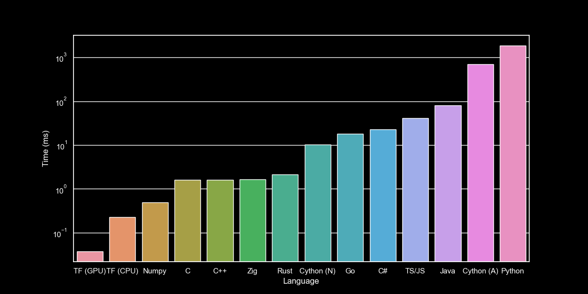
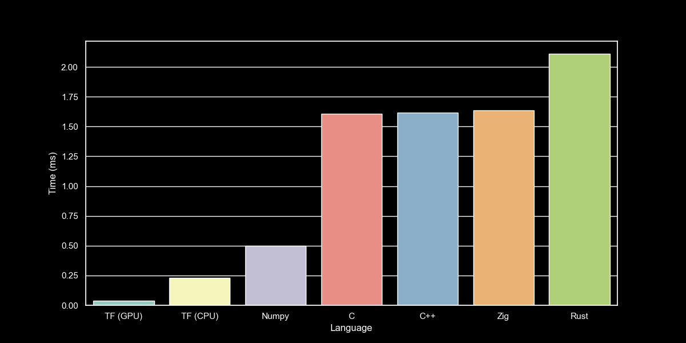

# Rules & Times

## Exericse

- Matrix multiplication for quadratic matrices (e.g. 250x250 sized - NxN)

## Rules

- No Multi-Processing/Threadding
- No external libraries
- No specific CPU instructions
- Dynamic Sized Array (or equivalent) must be used
- Data type is float 32bit

## Times

- TensorFlow (oneDNN AVX/AVX2 - GPU): 0.0374 ms
- TensorFlow (oneDNN AVX/AVX2 - Single Core CPU): 0.2297 ms
- Numpy (MKL - Single Core): 0.4966 ms
- C++: 1.6172 ms
- C: 1.6056 ms
- Zig: 1.6379 ms
- Rust: 2.1104 ms
- Cython (Numpy): 10.3034 ms
- Go: 17.956 ms
- C\#: 23.0100 ms
- JavaScript/TypeScript: 40.9734 ms
- Java: 80.1670 ms
- Cython (Python Array): 695.6066 ms
- Python: 1861.4496 ms
