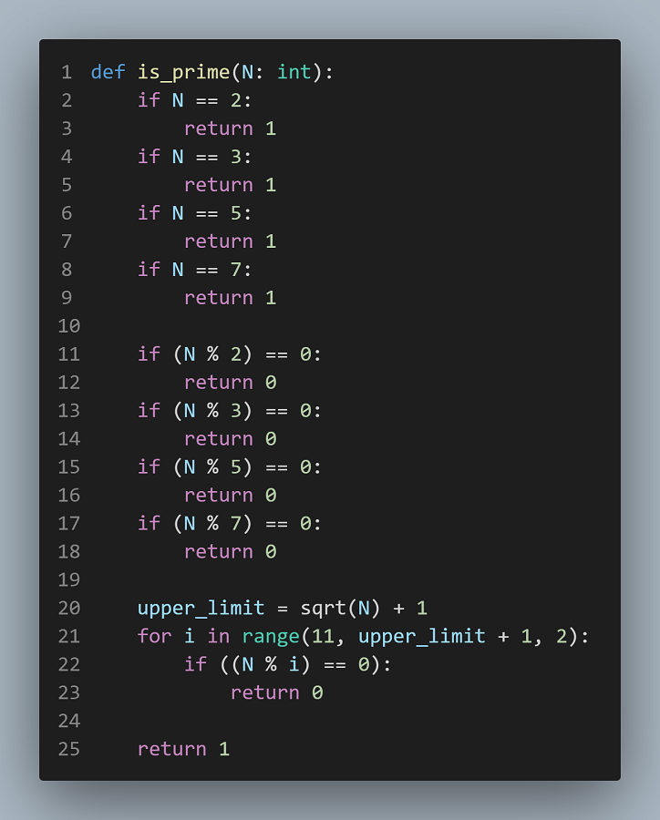
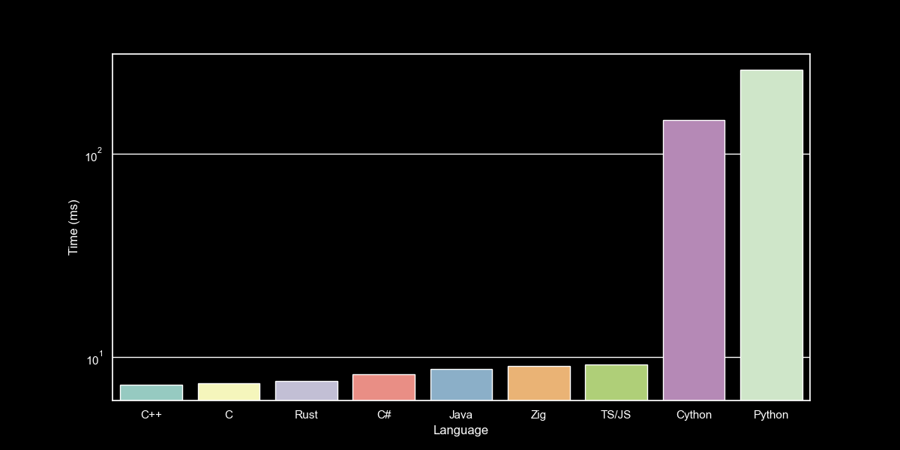
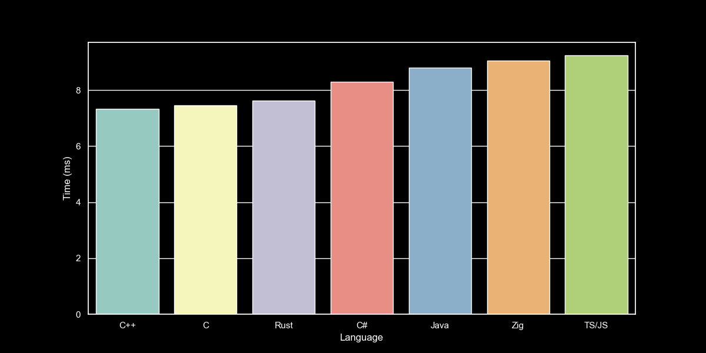

# Rules & Times

## Exericse

- Compute all primes numbers $\in [200000, 400000]$

## Times

- C++: 7.3343 ms
- C: 7.4500 ms
- Zig: 9.0616 ms
- Rust: 7.6278 ms
- C\#: 8.2900 ms
- JavaScript/TypeScript: 9.2438 ms
- Java: 8.8000 ms
- Cython: 146.4989 ms
- Python: 259.6320 ms
